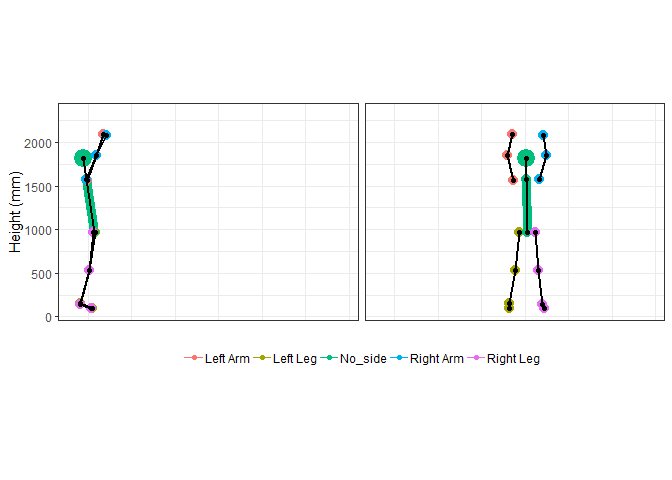
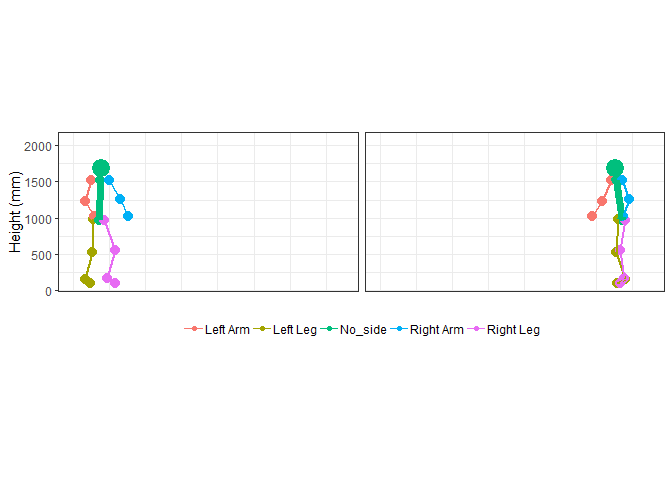
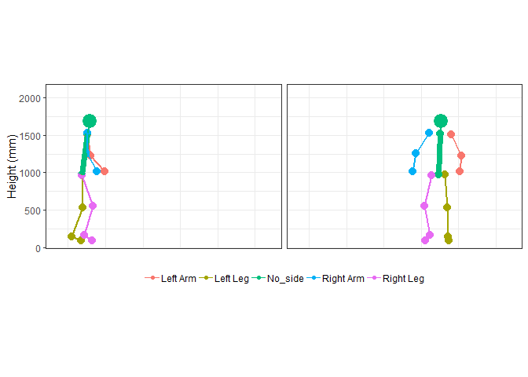
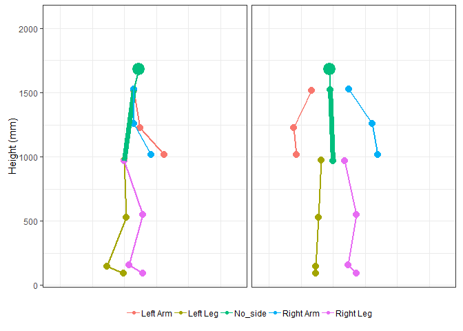
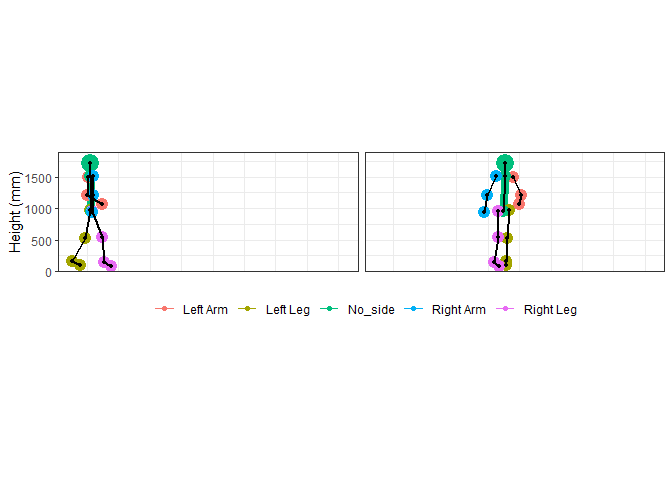
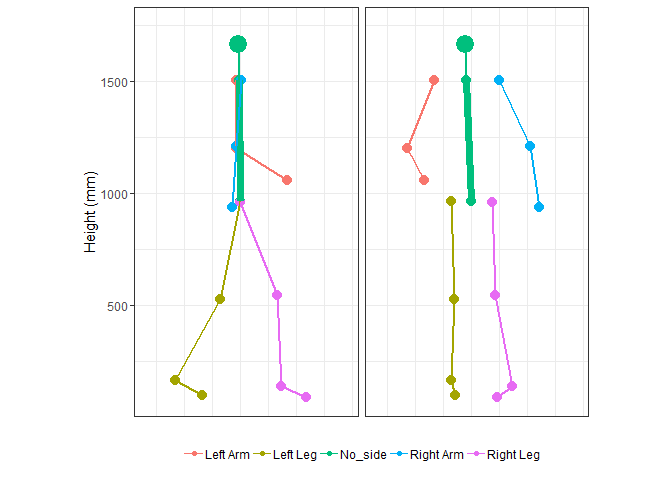

mocapr
================

<!-- README.md is generated from README.Rmd. Please edit that file -->

The goal of `mocapr` is to provide R functions to import, plot, animate,
and analyse motion capture data.

`mocapr` uses a series of tidyverse packages to import
([`readr`](https://github.com/tidyverse/readr),
[`tidyr`](https://github.com/tidyverse/tidyr),
[`dplyr`](https://github.com/tidyverse/dplyr),
[`stringr`](https://github.com/tidyverse/stringr),
[`forcats`](https://github.com/tidyverse/forcats)), plot
([`ggplot2`](https://github.com/tidyverse/ggplot2)), animate
([`gganimate`](https://github.com/thomasp85/gganimate)), and analyse
motion capture data.  
The package also contains a sample data set `MOCAP_data` which is
generated using some of the above packages as well as
[`purrr`](https://github.com/tidyverse/purrr).

While all functions should run without loading other libraries I
strongly recommend you load the tidyverse `library(tidyverse)`.

The package is in **the very early stages of development** and is only
**minimally effective** in the sense that it, at current, only supports
import from [the Captury](http://thecaptury.com/) system. My intent is
to make this package work with motion capture data from other sources as
well, and I expect to add a function that imports data from [the
Kinetisense](https://kinetisense.com/) system shortly.  
If you have motion capture data that contains frame by frame *joint
center positions* from other systems, it should be possible to wrangle
the data into a format that will allow you to use the functions in this
package. If you are willing to share the data, I will be happy to make
an attempt at writing an import function and include both the function
and the data in this package.  
Feedback and suggestions for improvement and future developments are
**most welcome**.

## Installation

`mocapr` can be installed directly from github using devtools:

``` r
# install.packages('devtools')
devtools::install_github('steenharsted/mocapr')
```

## The Sample Data `MOCAP_data`

All data included in the package is, at current, captured using the
Captury Live markerless motion capture system. Raw exports in .csv
format can be found in the folder “data-raw”.  
Each movement is also supplied with avi file showing the recording with
an overlay of the tracked poses. Unfortunately, these avi files can’t be
uploaded to GitHub due to their size (suggestions are welcome, I am
considering putting them on YouTube and adding links from there).

`MOCAP_data` consists of 6 movements, each supplied with a number
(`movement_nr`) and a short description (`movement_description`).

``` r
suppressPackageStartupMessages(library(tidyverse))
library(mocapr)

#Data
mocapr::MOCAP_data %>% 
  group_by(movement_nr, movement_description) %>% 
  tidyr::nest()
```

    ## # A tibble: 6 x 3
    ##   movement_nr movement_description                            data         
    ##         <dbl> <chr>                                           <list>       
    ## 1           1 standing long jump for maximal performance      <tibble [172~
    ## 2           2 standing long jump with simulated poor landing~ <tibble [228~
    ## 3           3 normal gait in a straight line                  <tibble [157~
    ## 4           4 normal gait in a semi square                    <tibble [375~
    ## 5           5 vertical jump for maximal performance           <tibble [143~
    ## 6           6 caipoera dance                                  <tibble [1,2~

Each movement contains frame by frame joint angles and global joint
center positions. All joint related variables are abbreviated according
to their side (L|R), joint(A|K|H|S|E|W), and angle/position. As such
each joint is typically represented by 6
columns.

| Side      | Joint        | Angle/Position                                        |
| :-------- | :----------- | :---------------------------------------------------- |
|           | A (Ankle)    | F (Flexion)                                           |
| L (left)  | K (Knee)     | Varus                                                 |
|           | H (Hip)      | DF (Dorsi Flexion)                                    |
| R (Right) | W (Wrist)    | X (joint center position on the global X axis (floor) |
|           | E (Elbow)    | Y (joint center position on the global Y axis)(up)    |
|           | S (Shoulder) | Z (joint center position on the global Z axis)(floor) |

Example for left
knee:

| Abbreviated Variable Name |                   Meaning of abbreviation                   |
| :-----------------------: | :---------------------------------------------------------: |
|            LKF            |                      Left Knee Flexion                      |
|            LKX            | Left Knee joint center position on the X axis (floor plane) |

The focus of this tutorial is on ploting and animating motion capture
data. For this we only need the joint center positions. I will not
discuss the joint angles further, but feel free to explore them on your
own.

Lets first create some sample data:

``` r
jump_1 <- mocapr::MOCAP_data %>% 
  filter(movement_nr == 1)

jump_2 <- mocapr::MOCAP_data %>% 
  filter(movement_nr == 2)

gait <-  mocapr::MOCAP_data %>% 
  filter(movement_nr == 4)

caipoera <- mocapr::MOCAP_data %>% 
  filter(movement_nr == 6)
```

The global joint center positions can be used for plots and animations
using the `animate_global()` function.

``` r
jump_1 %>% 
  animate_global(nframes = nrow(.), fps = 50)
```

<!-- --> Plots and
animations using global joint center positions will cause a oblique
viewpoint if the subject moves at an angle to the axis of the global
coordinate system. For the purpose of analysing or interpreting motions
an oblique viewpoint is, in general, less optimal. `jump_2` is an
example of such a movement.

``` r
jump_2 %>% 
  animate_global(nframes = nrow(.), fps = 50)
```

<!-- -->

In many cases out of axis movement is easy to prevent, and here the
`animate_global()` function might be sufficient, but in other cases
(e.g. working with pre-school children or more complicated movements
than walking), out of axis movement is difficult to prevent - at least
without interferring in the spontaneous movements of the subject. Also
the the orientation of the global coordinate system differs from system
to system and sometimes even between different setups of the same
motion-capture system. This creates a need for animation and plotting
functions that are free from the orientation of the global coordinate
system, and instead focussed on the subject or the direction of the
movement the subject is performing. `mocapr` solves this challenge by
providing two functions that projects the global joint center positions
onto the planes of the movement direction (`project_full_body_to_MP()`)
or the anatomical planes the subject (`project_full_body_to_AP()`). Each
project function should then be followed by it’s corresponding animation
function (`animate_movement()` or `animate_anatomical()`)

The movement planes are:  
\* Forward) a plane perpendicular to the floor, going in the direction
from the position of the subject at the first frame to the position of
the subject at the last frame.  
\* Side-wards) a plane perpendicular to the floor and the forwards
plane.

The anatomical planes are:  
\* Frontal) a plane perpendicular to the floor, going through both
hip-joint centers.  
\* Sagital) a plane perpendicular to the floor and the Frontal plane.

For movements where the subject is moving in one direction without
rotation (such as walking in a straight line, or jumping using both
legs) these two projections will be very similar to each other, but they
will differ greatly if the direction of the movement changes.This is
best explained by watching the animations produced by the animation
functions `mocapr::animate_movement()` and
`mocapr::animate_anatomical()`.

Lets look again at jump\_2 (the jump that is oblique to the global
coordinate system), and animate the jump using the `animate_movement()`
and the `animate_anatomical()` functions.

``` r
jump_2 %>%
  #Project to the movements planes
  project_full_body_to_MP() %>%
  #Animate the movement plane projections
  animate_movement(nframes = nrow(.), fps = 50, rewind = FALSE)
```

<!-- -->

``` r
jump_2 %>% 
  #Project to the anatomical Planes 
  project_full_body_to_AP() %>% 
  #Animate the anatomical projections
  animate_anatomical(nframes = nrow(.), fps = 50, rewind = FALSE)
```

<!-- -->

Besides the size difference the two animations are very similar. This is
because the movement that the subject is performing is
uni-directional.  
*note: the right side appears on the right side in the anatomical
animation and on the left side in the movement animation, this is
intentional but might change in future versions*.  
Lets explore the difference between the two types of projections by
looking at a movement that is not unidrectional.

``` r
gait %>%
  #Project to the movements planes
  project_full_body_to_MP() %>%
  #Animate the movement plane projections
  animate_movement(nframes = nrow(.), fps = 50, height = 800, width = 800)
```

<!-- -->

``` r
gait %>% 
  #Project to the anatomical Planes 
  project_full_body_to_AP() %>% 
  #Animate the anatomical projections
  animate_anatomical(nframes = nrow(.), fps = 50, height = 800, width = 800)
```

<!-- -->

Now the difference between the two types of animations is evident. While
both the animate\_movement() and the animate\_anatomical() gives you two
view points that are perpendicular to each other, animate\_movement()
gives you *fixed viewpoints* (you are standing still and watching the
movement) and animate\_anatomical() *updates your viewpoint for each
frame* (you are always the watching the subject from the front and the
side of the pelvis).

## using `mocapr` to plot

The three animate functions can be used to plot if you supply the
argument `animate = FALSE`. In that case the you will get a plot that is
faceted on the frames. I suggest you reduce the number of frames before
you use the functions to plot.

``` r
jump_2 %>% 
  project_full_body_to_AP() %>% 
  filter( frame == 120 | frame == 150 | frame == 165 | frame == 170) %>% 
  animate_anatomical(animate = FALSE)
```

<!-- -->
