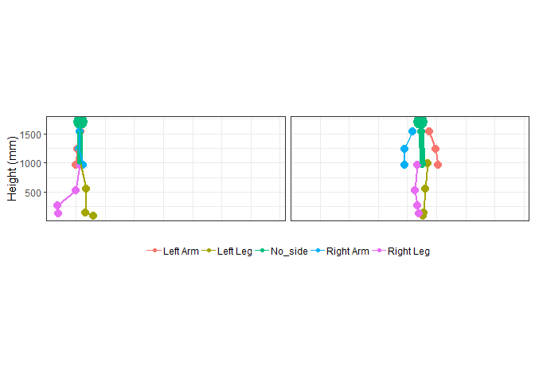
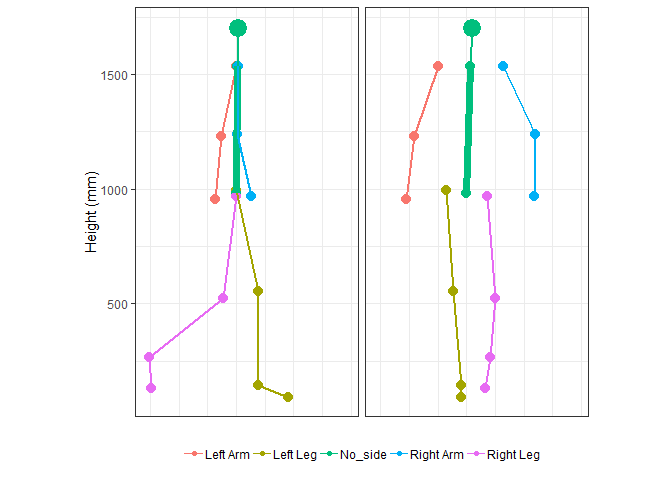
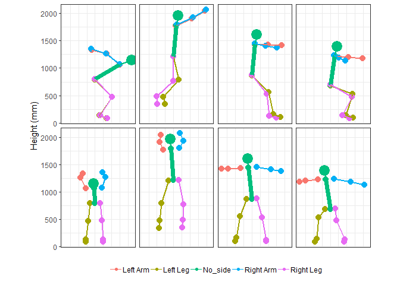

mocapr
================

<!-- README.md is generated from README.Rmd. Please edit that file -->

`mocapr` uses a series of tidyverse packages to import
([`readr`](https://github.com/tidyverse/readr),
[`tidyr`](https://github.com/tidyverse/tidyr),
[`dplyr`](https://github.com/tidyverse/dplyr),
[`stringr`](https://github.com/tidyverse/stringr),
[`forcats`](https://github.com/tidyverse/forcats)), plot
([`ggplot2`](https://github.com/tidyverse/ggplot2)), animate
([`gganimate`](https://github.com/thomasp85/gganimate)), and analyse
motion capture data.  
The package also contains sample data set `MOCAP_data` which is
generated using some of the above packages as well as
[`purrr`](https://github.com/tidyverse/purrr).

While all functions should run without loading other libraries I
strongly recommend you load the tidyverse `library(tidyverse)`.

The package is in **the very early stages of development** and is only
minimally effective in the sense that it, at current, only supports
import from [the Captury](http://thecaptury.com/) system. My clear
intent is to make this package work with motion capture data from
different sources, and I expect to add a function to import mocap data
from [the Kinetisense](https://kinetisense.com/) system shortly. If you
have motion capture data that contains frame by frame joint center
positions from other sources, you might be able to wrangle the data into
a format that will allow you to use the functions in this package. If
you are willing to share the data, I will be happy to help you write an
import function and include both the function and the data in this
package.  
Feedback and suggestions for improvement and future development is
**most welcome. **

## Installation

`mocapr` can be installed directly from github using devtools:

``` r
# install.packages('devtools')
devtools::install_github('steenharsted/mocapr')
```

Data + video(if possible) Function to import data into the
`mocapr`format global coordinate system anatomical projections movement
projections

## The Data

All data included in the package is, at current, captured using the
Captury Live markerless motion capture system. I have also prepared an
avi file for each movement, but these avi files can’t be uploaded to
GitHub due to their size (suggestions are welcome).

``` r
suppressPackageStartupMessages(library(tidyverse))
library(mocapr)

#Data
mocapr::MOCAP_data %>% 
  group_by(movement_nr, movement_description) %>% 
  tidyr::nest()
```

    ## # A tibble: 6 x 3
    ##   movement_nr movement_description                            data         
    ##         <dbl> <chr>                                           <list>       
    ## 1           1 standing long jump for maximal performance      <tibble [172~
    ## 2           2 standing long jump with simulated poor landing~ <tibble [228~
    ## 3           3 normal gait in a straight line                  <tibble [157~
    ## 4           4 normal gait in a semi square                    <tibble [375~
    ## 5           5 vertical jump for maximal performance           <tibble [143~
    ## 6           6 caipoera dance                                  <tibble [1,2~

The data contains frame by frame joint angles and global joint center
positions. All joint related variables are abbreviated according to
their side (L|R), joint(A|K|H|S|E|W), and position/angle. The focus of
this README is on joint center positions.  
Example for left knee:

    ## # A tibble: 3 x 2
    ##   Variable Meaning                                       
    ##   <chr>    <chr>                                         
    ## 1 LKX      Left Knee position on the X axis (floor plane)
    ## 2 LKY      Left Knee position on the Y axis (Up)         
    ## 3 LKZ      Left Knee position on the Z axis (floor plane)

The global joint center positions can be used for plots and animations,
but this will cause an oblique viewpoint if the subject moves at an
angle to axis of the global coordinate system. In many cases, such as
gait analysis on adults, out of axis movement will be easy to prevent,
but if work with other subjects, such as pre-school children, or more
complicated movements, such as caipoera, out of axis movement is likely
to occur. `mocapr` solves this challenge by providing to functions that
project the global joint center positions onto the anatomical planes the
subject (`mocapr::project_full_body_to_AP()`) or the planes of the
movement direction (`mocapr::project_full_body_to_MP()`).

The movement planes are: \* Forward) a plane perpendicular to the floor,
going in the direction from the position of the subject at the first
frame to the position of the subject at the last frame. \* Sidewards) a
plane perpendicular to the floor and the forwards plane.

The anatomcial planes are:  
\* Frontal) a plane perpendicular to the floor, going through both
hip-joint centers \* Sagital) a plane perpendicular to the floor and the
Frontal plane.

For movements where the subject is moving in one direction without
rotation (such as walking in a straight line, or jumping using both
legs) these two projections will be very similar to eachother, but they
will differ greatly if the direction of the movement changes.This is
best explained by wathing the animations produced by the animation
functions `mocapr::animate_movement()` and
`mocapr::animate_anatomical()`.

Lets first create some sample data:

``` r
gait_1 <- mocapr::MOCAP_data %>%
  filter(movement_nr == 3)

gait_2 <- mocapr::MOCAP_data %>%
  filter(movement_nr == 4)

caipoera <- mocapr::MOCAP_data %>% 
  filter(movement_nr == 6)

jump <- mocapr::MOCAP_data %>% 
  filter(movement_nr == 2)
```

### Example 1.A (walking straight movement plane)

``` r
gait_1 %>%
  #Project to the movements planes
  project_full_body_to_MP() %>%
  #Animate the movement plane projections
  animate_movement(nframes = nrow(.), fps = 50, rewind = FALSE)
```

<!-- --> \#\#\#
Example 1.B (walking straight anatomical plane)

``` r
gait_1 %>% 
  #Project to the anatomical Planes 
  project_full_body_to_AP() %>% 
  #Animate the anatomical projections
  animate_anatomical(nframes = nrow(.), fps = 50, rewind = FALSE)
```

<!-- -->

Besides the size difference the two animations are very similar (note:
the right side appears on the right side in the anatomical animation and
on the left side in the movement animation, this is intentional but
might change in future versions).

### Example 2.A (walking in a semi square movement plane)

``` r
gait_2 %>%
  #Project to the movements planes
  project_full_body_to_MP() %>%
  #Animate the movement plane projections
  animate_movement(nframes = nrow(.), fps = 50, rewind = FALSE)
```

<!-- -->

### Example 2.B (walking in a semi square anatomical plane)

``` r
gait_2 %>% 
  #Project to the anatomical Planes 
  project_full_body_to_AP() %>% 
  #Animate the anatomical projections
  animate_anatomical(nframes = nrow(.), fps = 50, rewind = FALSE)
```

<!-- -->

Now the difference between the two types of animations is evident. While
both the animate\_movement() and the animate\_anatimical() gives you two
view points that are perpendicular to eachother, animate\_movement()
gives you *fixed viewpoints* (you are standing still and watching the
movement) and animate\_anatmocial() *updates your viewpoint for each
frame* (you are always the watching the subject from the front and the
side of the pelvis).

## using `mocapr` to plot

Both the animate\_anatomical() and animate\_movement() functions can be
used to plot if you supply the argument `animate = FALSE`. In that case
the you will get a plot that is facetted on the frames. I suggest you
reduce the number of frames before you use the functions to plot.

``` r
jump %>% 
  project_full_body_to_AP() %>% 
  filter( frame == 120 | frame == 150 | frame == 165 | frame == 170) %>% 
  animate_anatomical(animate = FALSE)
```

<!-- -->
