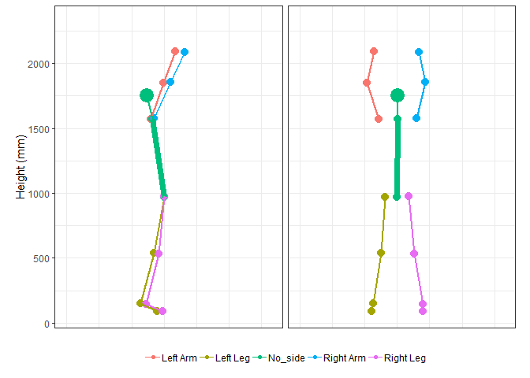
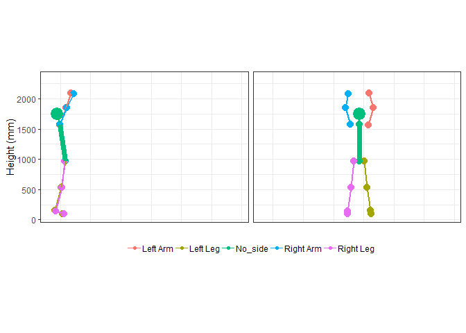
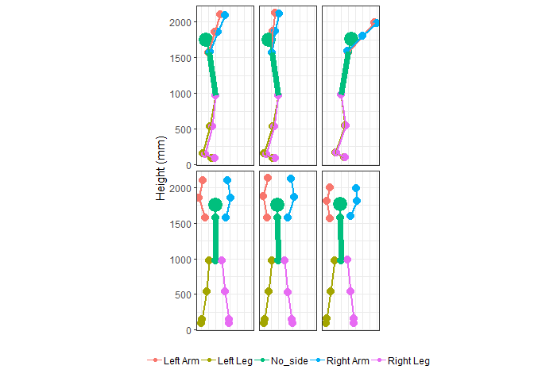
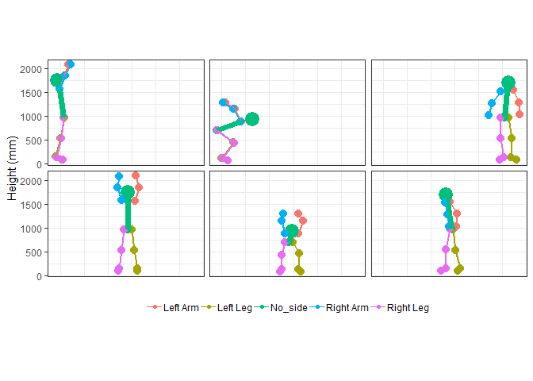

mocapr
================

<!-- README.md is generated from README.Rmd. Please edit that file -->

`mocapr` uses a series of tidyverse packages to import
([`tidyr`](https://github.com/tidyverse/tidyr),
[`dplyr`](https://github.com/tidyverse/dplyr),
[`stringr`](https://github.com/tidyverse/stringr),
[`forcats`](https://github.com/tidyverse/forcats)), plot
([`ggplot2`](https://github.com/tidyverse/ggplot2)), animate
([`gganimate`](https://github.com/thomasp85/gganimate)), and analyse
motion capture data.

The current state of the package is **work in progress**.

\#\#Why this package? Motion capture data has become readily availble,
and more will come It is becoming easy to collect this type of data Most
systems are using their own export formats (especially true for
markerless motion capture), and Open source tools to work with this data
has not followed the same trajectory.

\#\#The Vision

\#\#Can you help? Yes. Clinical background, ended up with the
programming part by nessescity. No programming skills when I started the
Ph.D., and I consider myself a beginner/intermediate R-user. While I
think the code is correct, I am quite sure that it is not optimal.
Input….

Data + video(if possible) Function to import data into the
`mocapr`format

## Installation

`mocapr` can be installed directly from github using devtools:

``` r
# install.packages('devtools')
devtools::install_github('steenharsted/mocapr')
```

\#\#The Data All data currently obtained from the CapturyLive system
Kinetisense to come Vicon plug-in-gait likely to come

``` r
library(mocapr)
#Data
Jump <- dplyr::as_tibble(mocapr::jump_1)
head(Jump)
```

    ## # A tibble: 6 x 70
    ##   mocap_system Frame Time_Seconds Marks    CGX   CGY   CGZ    LWX   LWY
    ##   <chr>        <dbl>        <dbl> <chr>  <dbl> <dbl> <dbl>  <dbl> <dbl>
    ## 1 Captury          1         0.02 <NA>  -1451. 1093.  20.6 -1321. 2094.
    ## 2 Captury          2         0.04 <NA>  -1450. 1093.  21.1 -1336. 2102.
    ## 3 Captury          3         0.06 <NA>  -1447. 1093.  21.5 -1353. 2109.
    ## 4 Captury          4         0.08 <NA>  -1444. 1093.  22.1 -1371. 2117.
    ## 5 Captury          5         0.1  <NA>  -1442. 1093.  22.4 -1384. 2122.
    ## 6 Captury          6         0.12 <NA>  -1440. 1093.  22.7 -1396. 2125.
    ## # ... with 61 more variables: LWZ <dbl>, LEX <dbl>, LEY <dbl>, LEZ <dbl>,
    ## #   LSX <dbl>, LSY <dbl>, LSZ <dbl>, RWX <dbl>, RWY <dbl>, RWZ <dbl>,
    ## #   REX <dbl>, REY <dbl>, REZ <dbl>, RSX <dbl>, RSY <dbl>, RSZ <dbl>,
    ## #   LTX <dbl>, LTY <dbl>, LTZ <dbl>, LAX <dbl>, LAY <dbl>, LAZ <dbl>,
    ## #   LADF <dbl>, X53 <dbl>, X54 <dbl>, LKX <dbl>, LKY <dbl>, LKZ <dbl>,
    ## #   LKF <dbl>, LKVarus <dbl>, LKRot <dbl>, LHX <dbl>, LHY <dbl>,
    ## #   LHZ <dbl>, LHF <dbl>, LHA <dbl>, LHRot <dbl>, RTX <dbl>, RTY <dbl>,
    ## #   RTZ <dbl>, RAX <dbl>, RAY <dbl>, RAZ <dbl>, RADF <dbl>, X77 <dbl>,
    ## #   X78 <dbl>, RKX <dbl>, RKY <dbl>, RKZ <dbl>, RKF <dbl>, RKVarus <dbl>,
    ## #   RKRot <dbl>, RHX <dbl>, RHY <dbl>, RHZ <dbl>, RHF <dbl>, RHA <dbl>,
    ## #   RHRot <dbl>, HAX <dbl>, HAY <dbl>, HAZ <dbl>

\#\#Example 1

``` r
#Project to movements planes
Jump %>% 
  project_full_body_to_MP() %>%
  #Animate the movement plane projections
  animate_movement(nframes = nrow(.)*2, fps = 50, rewind = FALSE)
```

    ## Registered S3 methods overwritten by 'ggplot2':
    ##   method         from 
    ##   [.quosures     rlang
    ##   c.quosures     rlang
    ##   print.quosures rlang

<!-- -->

\#\#Example 2

``` r
#Project to Anatomical Planes 
Jump %>% 
  project_full_body_to_AP() %>% 
  #Animate the anatomical projections
  animate_anatomical(nframes = nrow(.)*2, fps = 50, rewind = FALSE)
```

<!-- -->

``` r
library(dplyr)
```

    ## 
    ## Attaching package: 'dplyr'

    ## The following objects are masked from 'package:stats':
    ## 
    ##     filter, lag

    ## The following objects are masked from 'package:base':
    ## 
    ##     intersect, setdiff, setequal, union

``` r
Jump %>% 
  project_full_body_to_AP() %>% 
  filter(Frame == 2 | Frame == 10 | Frame == 25) %>% 
  animate_anatomical(animate = FALSE)
```

<!-- -->

``` r
library(dplyr)
Jump %>% 
  project_full_body_to_MP() %>% 
  filter(Frame == min(Frame) | Frame == max(Frame) | Frame == 50) %>% 
  animate_movement(animate = FALSE)
```

<!-- -->
