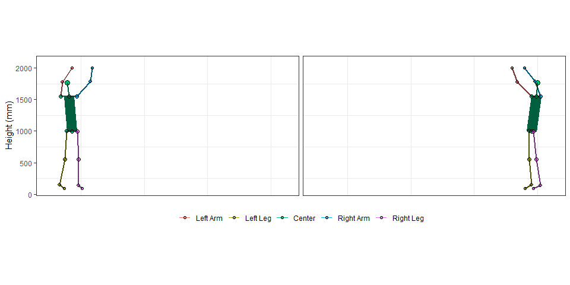
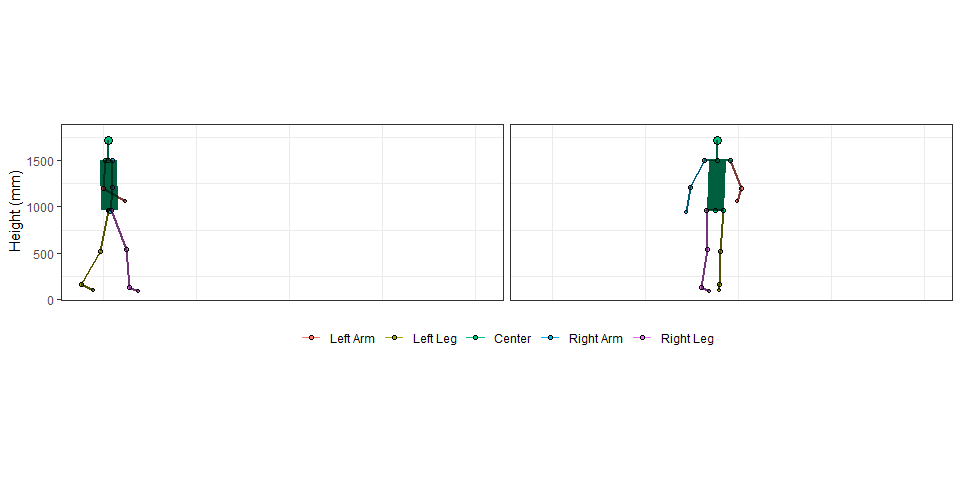
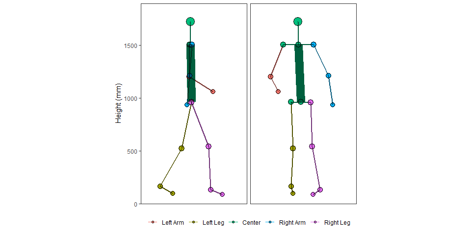
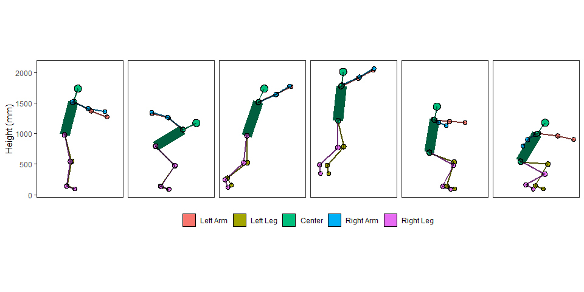
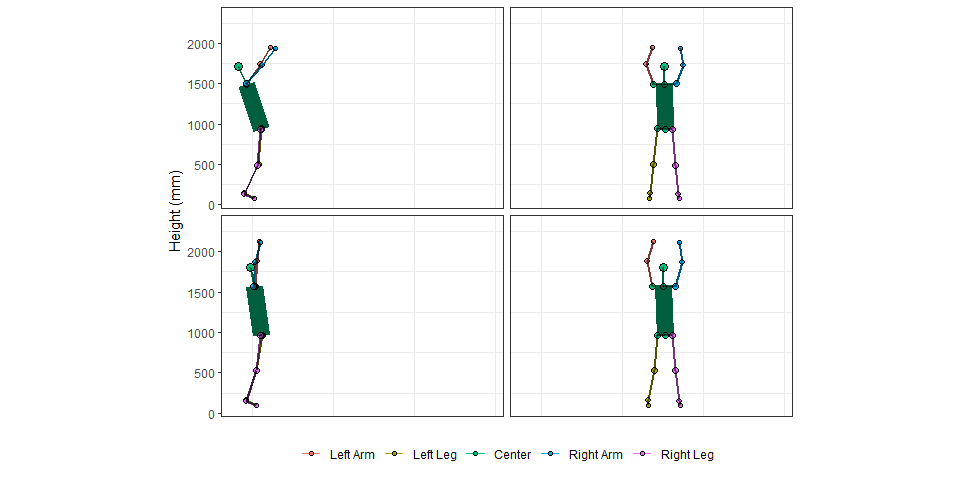
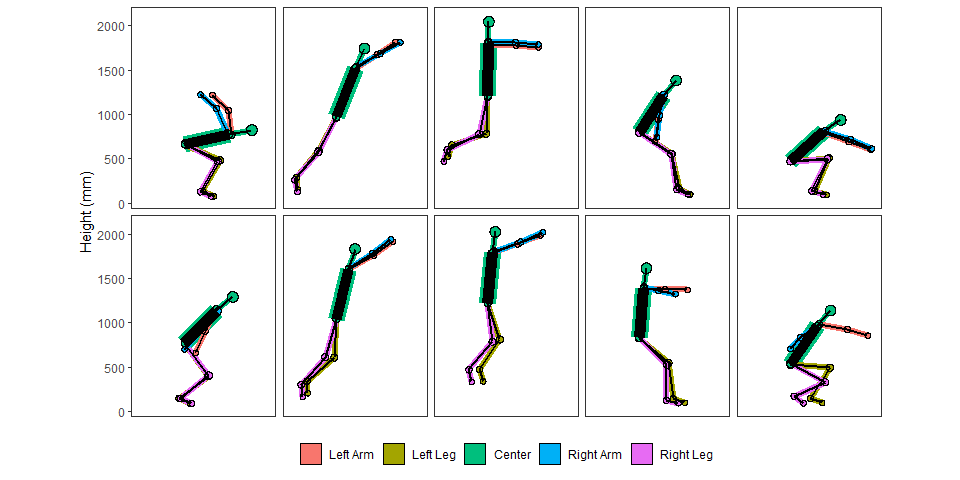
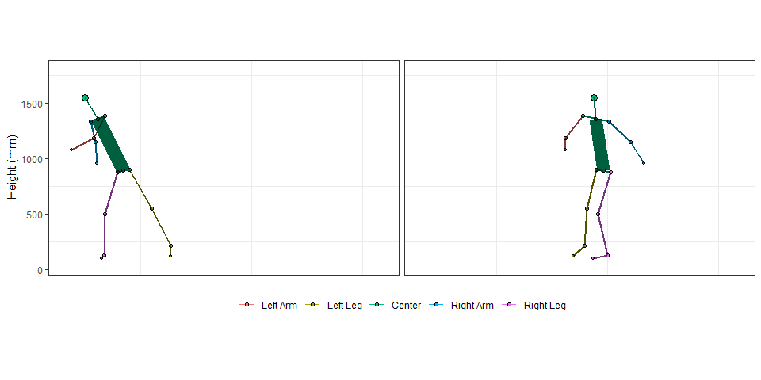

mocapr
================

<!-- README.md is generated from README.Rmd. Please edit that file -->
<!-- badges: start -->

[](https://github.com/steenharsted/mocapr/actions/workflows/R-CMD-check.yaml)
[](https://github.com/steenharsted/mocapr/actions/workflows/test-coverage.yaml)
<!-- badges: end -->

The goal of `mocapr` is to help researchers and clinicians to work with
motion capture data in R by providing functions that can import, plot,
animate, and analyse motion capture data.

`mocapr` uses a series of tidyverse packages to import
([`readr`](https://github.com/tidyverse/readr),
[`tidyr`](https://github.com/tidyverse/tidyr),
[`dplyr`](https://github.com/tidyverse/dplyr),
[`stringr`](https://github.com/tidyverse/stringr),
[`forcats`](https://github.com/tidyverse/forcats)), plot
([`ggplot2`](https://github.com/tidyverse/ggplot2),
[`ggforce`](https://ggforce.data-imaginist.com/)), animate
([`gganimate`](https://github.com/thomasp85/gganimate)), and analyse
motion capture data.  
The package also contains two sample data sets `mocapr_data` and
`mocapr_synthetic_data` which is generated using some of the above
packages as well as [`purrr`](https://github.com/tidyverse/purrr).

While all functions should run without loading other libraries I
recommend you also load the tidyverse `library(tidyverse)` when loading
the mocapr library.

## Installation

You can install the development version of `mocapr` from
[GitHub](https://github.com/) with:

``` r
# install.packages("devtools")
devtools::install_github("steenharsted/mocapr")
```

You may have to install additional packages manually that are needed in
order to run `gganimate` functions.

### Import files

`mocapr` supports import of .csv files from motion capture systems like:
[the Captury](http://thecaptury.com/),
[FreeMoCap](https://github.com/freemocap/freemocap), and
[OptiTrack](https://optitrack.com/), as well as kinematic output files
(.mot) from [OpenCap](https://www.opencap.ai/).

`mocapr` is capable of working with motion capture data from other
systems as long as the data contain frame by frame global spatial
joint-center positions. If the data contains these positions it is
possible to wrangle the data into a format that will allow usage of the
functions in this package. If you have such motion capture data from
other systems, I will be happy to make an attempt at writing an import
function and include the function in future versions of this package.

## Functions and objects in `mocapr`

- **Import Functions:**
  - `import_captury_csv()`
  - `import_freemocap_csv()`
  - `import_optitrack_csv()`
- **Projection functions**
  - `project_full_body_to_AP()`
  - `project_full_body_to_MP()`
- **Animation and plotting functions**
  - `animate_global()`
  - `animate_anatomical()`
  - `animate_movement()`
- **Helper functions for animations**
  - `align_movements()`
- **Kinematics in the anatomical frontal plane**
  - `add_frontal_plane_knee_angle()`
  - `add_frontal_plane_projection_angle()`
  - `add_frontal_plane_knee_deviation()`
  - `add_knee_ankle_hip_ratios()`
- **Built in data sets**
  - `mocapr_data`
  - `mocapr_synthetic_data`
- **Movement specific functions**
  - `add_jump_length_and_height()`
  - `add_phases_jump()`
  - `add_squat_events()`

The functions and datasets have descriptions and examples that can be
explored using `help(function_name)` or `?function_name`.

The intended workflow using the above functions and supplied datasets is
visualized below. 

### The built in datasets

`mocapr` contains two sample data sets `mocapr_data` and
`mocapr_synthetic_data`

#### mocapr_data

`mocapr_data` consists of 11 movements, each supplied with a number
(`movement_nr`) and a short description (`movement_description`). Videos
of the movements with an overlay of the track is available at this
[YouTube
playlist](https://www.youtube.com/playlist?list=PLMjrjny4Ymmd1nSGHU0A6dWfEWjBxc-VQ).
The videos are made using the CapturyLive software.

The data is also available as raw exports in .csv format, and can be
found in the folder “data-raw”.

Lets load `mocapr` and inspect the `mocapr_data`:

``` r
library(tidyverse)
library(mocapr)

#Data
mocapr_data %>% 
  group_by(movement_nr, movement_description) %>% 
  nest()
#> # A tibble: 11 × 3
#> # Groups:   movement_nr, movement_description [11]
#>    movement_nr movement_description                                     data    
#>          <dbl> <chr>                                                    <list>  
#>  1           1 standing long jump for maximal performance               <tibble>
#>  2           2 standing long jump for maximal performance               <tibble>
#>  3           3 standing long jump with simulated poor landing techniqu… <tibble>
#>  4           4 vertical jump for maximal performance                    <tibble>
#>  5           5 gait normal in a straight line                           <tibble>
#>  6           6 gait normal in a semi square                             <tibble>
#>  7           7 gait with simulated drop foot                            <tibble>
#>  8           8 gait with simulated internal rotation                    <tibble>
#>  9           9 capoeira dance                                           <tibble>
#> 10          10 forward lunge normal                                     <tibble>
#> 11          11 squat normal                                             <tibble>
```

The format of the data is wide and contains frame by frame joint angles
and global joint center positions. Therefore, each joint is typically
represented by 6 columns (3 angles and 3 positions). To prevent long
repetitive column names, all joint related variables are abbreviated
according to their side (L\|R), joint(A\|K\|H\|S\|E\|W), and
angle\|position.

| Side | Joint | Angle/Position |
|:---|:---|:---|
|  | A (Ankle) | F (Flexion) |
| L (left) | K (Knee) | Varus |
|  | H (Hip) | DF (Dorsi Flexion) |
|  | T (Toe) |  |
| R (Right) | W (Wrist) | X (joint center position on the global X axis (floor) |
|  | E (Elbow) | Y (joint center position on the global Y axis)(up) |
|  | S (Shoulder) | Z (joint center position on the global Z axis)(floor) |

Example for left knee:

| Abbreviated Variable Name | Meaning of abbreviation |
|:--:|:--:|
| LKF | Left Knee Flexion |
| LKX | Left Knee joint center position on the X axis (floor plane) |

The focus of this tutorial is on plotting and animating motion capture
data. For this we only need the joint center positions. I will not
discuss the joint angles further, but feel free to explore them on your
own.

#### `mocapr_synthetic_data`

Is artificial data generated via a script. It only contains spatial
joint-center positions in the anatomical planes. `mocapr_synthetic_data`
is intended to display how the frontal plane kinematics work, and also
to display sitations where they are likely to fail due to planar
cross-talk.

## Animating Motion Capture Data With `mocapr`

Lets first create some sample data:

``` r
jump_1 <- filter(mocapr::mocapr_data, movement_nr == 2)

jump_2 <- filter(mocapr::mocapr_data, movement_nr == 3)

gait <-  filter(mocapr::mocapr_data, movement_nr == 6)

capoeira <- filter(mocapr::mocapr_data, movement_nr == 9)
```

### Animating with `animate_global()`

The global coordinate system refers to a 3D coordinate system (X, Y, and
Z axis) that is created and oriented during the setup and calibration of
many motion capture systems. Global joint center positions refer to the
position of a given joint center inside the global coordinate system.  
The `animate_global()` function animates the subject using the global
joint center positions. It creates two animations: one in the X and Y
plane; and one in the Z and Y plane. If the subject is moving along
either the X or the Z axis the viewpoints will essentially be a side
view and a front\|back view.

``` r
jump_1 %>% 
  animate_global(
    
    # gganimate options passed via ...
    nframes = nrow(.), 
    fps = 50)
```


If the recorded subject moves out of the primary planes of the global
coordinate system, animations and plots using global joint center
positions will appear skewed or tilted. This is what we refer to as
‘out-of-plane movement’. For instance, `jump_2` simulates a poor landing
on the right knee, with the direction of the movement occurring out of
the primary planes (X and Z axes) in the global coordinate system.
Consequently, using the `animate_global()` function on `jump_2` produces
an animation that exhibits this out-of-plane movement, which could
potentially make the animation more challenging to interpret.

``` r
jump_2 %>% 
  animate_global(
    
    # gganimate options passed via ...
    nframes = nrow(.), 
    fps = 50)
```



## Dealing with out-of-plane movement

### Animating with `animate_movement()` and `animate_anatomical()`

In many instances, it’s straightforward to prevent out-of-plane movement
and oblique viewpoints, making the `animate_global()` function
sufficient. However, there are scenarios, such as when working with
pre-school children, where preventing movement that deviates from the
primary axes is challenging without interfering with the subject’s
spontaneous movements. Oblique viewpoints can also arise from variations
in the orientation—such as rotational or translational differences—of
the global coordinate system between different motion capture systems or
setups.

For the purpose of analyzing or interpreting motions, out-of-plane
movement can distort the perception of movement. This necessitates
animation and plotting functions that are independent of the orientation
of the global coordinate system, focusing instead on the subject itself
or the direction of the movement the subject is performing.

`mocapr` addresses this challenge by providing two functions:
`project_full_body_to_MP()` and `project_full_body_to_AP()`. The former
projects the global joint center positions onto the planes aligned with
the direction of movement, while the latter projects them onto the
anatomical planes of the subject. Essentially, these functions create
new coordinate systems that are shifted or tilted versions of the global
coordinate system.

As a result, animations that use the joint center positions in these new
coordinate systems, such as those created by `animate_movement()` or
`animate_anatomical()`, will have viewpoints that are directly in front
of and to the side of the direction of the movement or the person. This
allows for a more accurate and intuitive interpretation of the motion.

The direction of the movement is determined by the position of the
subject at the first and the last frame of the recording.

These functions are best explained by looking at animations.

Lets look again at `jump_2` (the jump that is oblique to the global
coordinate system), and animate the jump using the `animate_movement()`
and the `animate_anatomical()` functions.

``` r
jump_2 %>%
  
  # Project to the movements planes
  project_full_body_to_MP() %>%
  
  # Animate the movement plane projections
  animate_movement(
    
    # gganimate options passed via ...
    nframes = nrow(.),
    fps = 50, rewind = FALSE
    )
```


``` r
jump_2 %>% 
  #Project to the anatomical Planes 
  project_full_body_to_AP() %>% 
  
  #Animate the anatomical projections
  animate_anatomical(
    #gganimate options passed via ...
    nframes = nrow(.), 
    fps = 50)
```


*note: the right side appears on the right side in the anatomical
animation and on the left side in the movement animation, this is
intentional but might change in future versions*.

Besides the size difference the two animations are very similar. This is
because the movement that the subject is performing is uni-directional.
For movements where the subject is moving in one direction with limited
rotation of the pelvis (such as walking in a straight line, or jumping
using both legs) the two projections and the following animations will
produce similar results, but the results will differ greatly if the
direction of the movement changes throughout the recording.

Lets explore the difference between the two types of projections by
looking at a movement that is not unidirectional.

#### animate_movement()

``` r
gait %>%
  
  # Project to the movements planes
  project_full_body_to_MP() %>%
  
  # Animate the movement plane projections
  animate_movement(
    
    # gganimate options passed via ...
    nframes = nrow(.), 
    fps = 50
    )
```



#### animate_anatomical()

``` r
gait %>%
  
  # Project to the anatomical Planes 
  project_full_body_to_AP() %>%
  
  # Animate the anatomical projections
  animate_anatomical(
    
    # gganimate options passed via ...
    nframes = nrow(.),
    fps = 50
    )
```



Now the difference between the two types of animations is evident.
`animate_movement()` gives you *fixed viewpoints* (you are standing
still and watching the movement) and `animate_anatomical()` *updates
your viewpoint for each frame* (you are always watching the subject from
the back and the side of the pelvis).

## using `mocapr` to plot

The three animate functions can be used to plot if you supply the
argument `return_plot = TRUE`. I suggest you reduce the number of frames
before you use the functions to plot.

``` r
jump_2 %>%
  
  # Project to the anatomical Planes
  project_full_body_to_AP() %>% 
  
  # Reduce the number of frames in the data
  filter(frame %in% c(100, 120, 140, 150, 170, 180)) %>% 
  
  # Animate the anatomical projections
  animate_anatomical(planes = c("F"),
                     use_geom_point = FALSE, 
                     planes_in_rows_or_cols = c("cols"), 
                     col_facets = frame,
                     return_plot = TRUE)
```



## Animating and plotting multiple movements

`mocapr` utilizes the powerful faceting features of `ggplot2`. This
means that you can plot and animate mulitple movements next to
eachother. This is especially usefull if you wish to visualize variation
in movement patterns (test-retest or pre-post treatment scenarios).

When you animate multiple movements the movements will only rarely have
the same duration. `mocapr` allows you to align such movements based on
a key event via the function `align_movements()`

The below example aligns and animates two standing broad jumps. The
jumps are aligned on the frame containing the impact frame.

``` r
mocapr_data %>% 
  filter(movement_nr %in% c(1,2)) %>% 
  
  align_movements(
    .group_var = movement_nr,  # The column that contains the grouping
    event_var = marks, # The column that contains the key event
    event_value = "FFB",  # The value specifying the key event in the event_var column
    prolong_event = 25  #  Nr. of frames you would like to "freeze" the key event
    ) %>% 
  
  
  animate_global(
    row_facets = movement_nr,
    
    # gganimate options passed via ...
    nframes = nrow(.),
    fps = 50)
```



When plotting, it is less of an issue if the recordings are of differing
duration, but you need to select the frames of importance in some other
way.

The below example takes two jumps, divide the jumps into phases using
the `add_jump_events()` function and then filters individual frames
based on the phases.

``` r
mocapr_data %>% 
  
  # Take two jumps
  filter(movement_nr %in% c(1,3)) %>% 
  group_by(movement_nr) %>% 
  
  # Add jump phases and events
  group_modify(~add_phases_jump(.x)) %>% 
  group_modify(~project_full_body_to_AP(.x)) %>%
  
  # Keep only single frame events and highest position in jump
  filter(
    phase_b %in% c(2, 4, 6, 8, 10)) %>% 
  
  animate_anatomical(
    planes = "F",             # Show only the forward plane, change to "R for the forward plane. Remove for both planes
    row_facets = movement_nr, # Facet the two movements in two rows
    col_facets = phase_b,       # Facet the phases in columns
    return_plot = TRUE,       # Return a plot

    # Just styling options
    use_geom_point = FALSE,
    line_colored_size = 1.2,
    line_black_size = 1,
    line_black_alpha = 1)
```



## Adjust the speed of the animation

I find slow-mo effects is best achieved by adding more rows, e.g.,
`nrow(.)*2`

``` r
capoeira %>% 
  filter(frame > 48 & frame < 223) %>% 
  project_full_body_to_MP() %>% 
  animate_movement(
    
    #gganimate options passed via ...
    nframes = nrow(.)*2, 
    fps = 50)
```


